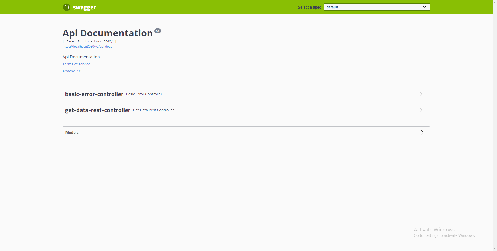

#Distributed File Sharing Application

### Group Members
>* Nuwan Samarasinghe (199360G)
>* Banu Liyanapathirana  (199380R)
>* Hasitha Maduranga     (199344L)
>* Chathura Siriwardhana (199366F)
#

### Application run configurations (we are using spring boot configuration)

- First execute : ```distributed-file-sharing-app\src\main\java\com\assignment\distributedfilesharingapp\server\BootstrapServer.java```
- For every run change this apache port : 
```server.port: 8081```
- To enable console mode : ```app.enable-console:true``` otherwise ```false```
- Then execute : ```DistributedFileSharingAppApplication.java```
#

### How to Test

#### Swagger method

in browser type following link : ```https://localhost:8081/swagger-ui.html```
(change the port according to the ```server.port: 8081```)



__Following are the rest end points that can use__

* ```/file``` : get all the file list in the current node


* ```/file{fileName}``` get file information per node


* ```/file/download``` download file to application running server


* ```/ip-table``` get ip table of the current node


#### Console method

console ui


To print the ip table => use option (2) `<(Number 2 key then Enter)>`

To exit from the network => use option (3) `<(Number 3 key then Enter)>`

search files choose option 1 => use option (1) `<(Number 1 key then Enter)>`


In the prompted ```Enter your search query below : ``` enter the file name

Then from the response lit select the option number `<(Number key then Enter)>`

it will download the file to the server


